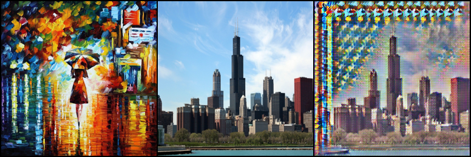

### A simple implement of Fast Style Transfer (Pytorch)

#### Transfer Result

Just OK 🤔

#### Reference

- https://github.com/lengstrom/fast-style-transfer

- https://blog.csdn.net/weixin_48866452/article/details/109309245

- https://keras.io/examples/generative/neural_style_transfer/

